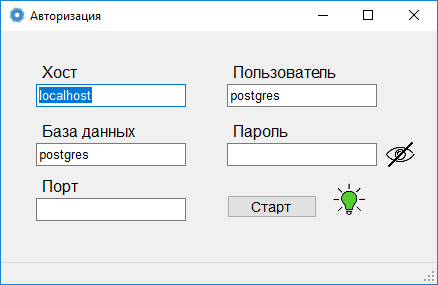
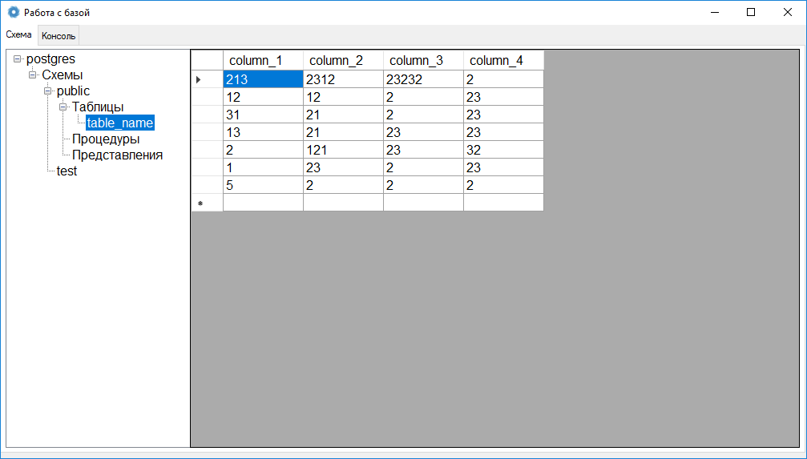
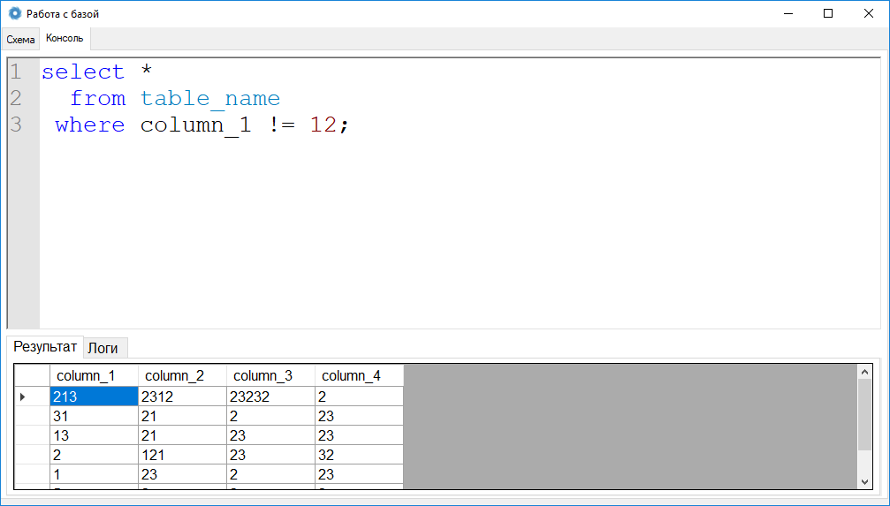

# Postgre-client

Клиент для субд PostgreSQL на платформе windows, реализован на .net

## Подключение к субд

Подключение к субд происходит в окне авторизации приложения,
максимальное время подлкючения 5 секунд, после чего интерфейс отражает
результат подключения. Подкючение происходит асинхронно.

Окно авторизации:

Окно главного меню:

## Функции
Работает со всеми типами запросов как DML так и DDL,
Присутствует возможность редактирования и удаления таблиц с помощью графического интерфейса, введены только базовые типы
Редактирование таблиц осуществляется в браузере схемы, присутствует возможность добавления записей и удаления, работа с автоинкрементами.

Окно консоли:

## Автор

* **Максим Шипицин** - *Разработка проекта и требований* - [ IngeniariusSoftware](https://github.com/IngeniariusSoftware)

## License

This project is licensed under the MIT License - see the [LICENSE.md](LICENSE.md) file for details

## Спасибо
- Авторам библиотеки [Npgsql](https://www.npgsql.org/) за готовую библиотеку для работы с PostgreSQL
- Авторам библиотеки [Scantilla.Net](https://github.com/jacobslusser/ScintillaNET) за инструмент для реализации полноценной консоли запросов

